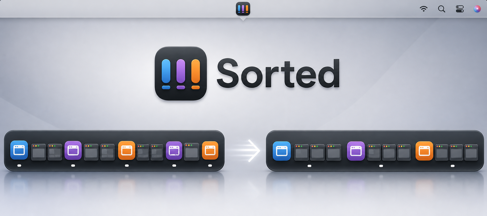

# Sorted



**Sorted** is a small native macOS menu-bar utility for arranging open windows
and grouping minimized Dock thumbnails by app.

macOS can place minimized windows individually in the Dock, but it does not
provide a built-in way to regroup those thumbnails later. Sorted fills that
gap with a one-click, live Dock sorter.

## Features

- **Group Minimized Windows in Dock** makes each app's minimized thumbnails
  contiguous while preserving their existing order.
- **Group Windows by App** places visible windows from each app together.
- **Tile Frontmost App** fills the main display with the active app's windows.
- **Cascade All Windows** creates an easy-to-scan stack.
- Global keyboard shortcuts: **⌃⌥G** group by app, **⌃⌥T** tile frontmost,
  **⌃⌥C** cascade, **⌃⌥M** sort the Dock (press again to cancel).
- Runs entirely as a menu-bar utility with no Dock icon, with an optional
  **Launch at Login** toggle.
- Performs all work locally. No analytics, network requests, or cloud services.

## How Dock Sorting Works

Apple does not expose a supported API for changing minimized-thumbnail order.
Sorted uses the macOS Accessibility API to identify Dock thumbnails and their
owning apps, then performs verified drag moves to group them.

Because the Dock only accepts reordering through drag input:

- Sorted briefly uses the pointer while sorting.
- The pointer returns to its original position afterward.
- The Dock must be visible.
- **Minimize windows into application icon** must be turned off.
- A second click may occasionally be needed if the Dock rejects a move.
- Sorting runs in the background; open the menu again and choose
  **Cancel Dock Sorting** to stop it early.

## Requirements

- macOS 13 or later
- Accessibility permission for Sorted
- Swift 6-compatible toolchain to build from source

## Run From Source

Clone the repository, then run:

```sh
sh run.sh
```

The first arrangement action prompts for Accessibility access. Enable Sorted
under:

**System Settings → Privacy & Security → Accessibility**

For live Dock sorting, also turn off:

**System Settings → Desktop & Dock → Minimize windows into application icon**

## Build a Real App Bundle

Create a normal menu-bar-only `Sorted.app` bundle:

```sh
sh scripts/build-app.sh
```

The result is written to `dist/Sorted.app`. Consistently signed releases use
the stable bundle identifier `com.jessholbrook.Sorted`, allowing macOS to retain
Accessibility permission between updates.

For Developer ID signing, notarization, and release packaging, see
[DISTRIBUTION.md](DISTRIBUTION.md).

For the sandboxed Xcode target and App Store submission materials, see
[APP_STORE_SUBMISSION.md](APP_STORE_SUBMISSION.md).

## Use

1. Minimize several windows from multiple apps so their thumbnails appear in
   the Dock.
2. Keep the Dock visible.
3. Click the Sorted menu-bar icon.
4. Select **Group Minimized Windows in Dock**.

Sorted groups each app's thumbnails together based on the first appearance of
that app. It preserves thumbnail order within each group and avoids moving
windows that are already grouped.

## Verify

Build the app and run the tests:

```sh
swift build
swift test
```

If your Command Line Tools SDK does not match the installed compiler, run the
app with `SORTED_BUILD_WORKAROUNDS=1 sh run.sh`, which pins a known-good SDK
and uses a repo-local home and module cache.

## Project Structure

```text
Sources/
  Sorted/        Menu-bar app, Accessibility integration, and Dock sorting
  SortedCore/    Testable window-layout geometry
Tests/
  SortedCoreTests/  Layout geometry tests
```

## Known Limitations

- Dock sorting depends on Accessibility behavior that may change between macOS
  releases.
- Some apps opt out of Accessibility window movement.
- Some fixed-size windows may reject requested sizes.
- Visible-window arrangements currently target the main display.
- The Dock sorter still needs validation under App Sandbox and App Review;
  Developer ID-signed and notarized direct distribution is the reliable
  fallback.

## Privacy

Sorted inspects window titles and positions through macOS Accessibility solely
to perform the requested local arrangement. It does not store or transmit that
information. See the full [Privacy Policy](PRIVACY.md).

## Contributing

Issues and pull requests are welcome. Useful areas for improvement include
multi-display layouts, configurable grouping rules, keyboard shortcuts, and a
signed `.app` release workflow.

## License

Sorted is available under the [MIT License](LICENSE).
